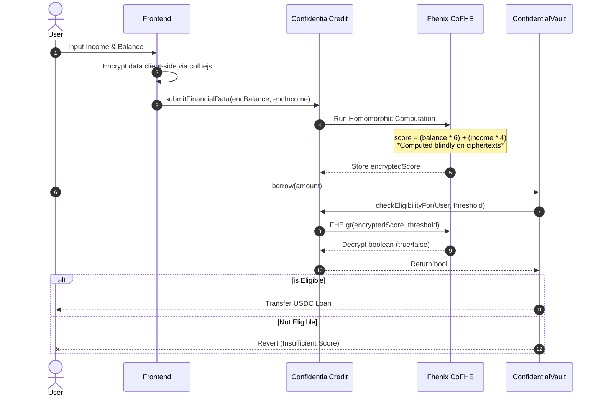

<div align="center">
  <h1>🛡️ ConfidentialCredit Protocol</h1>
  <p><strong>Trustless, Privacy-Preserving Undercollateralized Lending powered by Fhenix & Fully Homomorphic Encryption (FHE)</strong></p>
</div>

---

## 📖 What is ConfidentialCredit?

**ConfidentialCredit** is a revolutionary decentralized lending protocol that solves DeFi's biggest problem: the requirement for over-collateralization. 

By leveraging **Fully Homomorphic Encryption (FHE)** via the Fhenix Helium network, ConfidentialCredit allows users to compute a verifiable on-chain credit score using their real-world financial data (income and bank balance) **without ever revealing that data to the public.** 

Ciphertexts are processed blindly by the Fhenix CoFHE coprocessor to output a single unencrypted `Yes / No` eligibility boolean to the lending Vault. **Your data remains completely private, yet mathematically verifiable.**

> **Privacy-as-a-Deterrent:** The only time a user's financial privacy is broken is if they default on their loan past the 30-day term. The protocol acts as a trustless credit bureau, punishing defaulting actors by de-anonymizing their real score.

---

## 🚀 Live Deployments (Arbitrum Sepolia)

The protocol is fully deployed and verified on the Fhenix Helium Network (Arbitrum Sepolia).

| Contract | Verified Address | Explorer Link |
|----------|----------------|--------------|
| **ConfidentialCredit** | `0xD7840983B638cFcf9fC0CD32b358B02eb43E59Ef` | [View on Explorer](https://sepolia.arbiscan.io/address/0xD7840983B638cFcf9fC0CD32b358B02eb43E59Ef) |
| **ConfidentialVault** | `0x24bE9C74CFCA5313f388c87106cb7B4a41A8F3c9` | [View on Explorer](https://sepolia.arbiscan.io/address/0x24bE9C74CFCA5313f388c87106cb7B4a41A8F3c9) |
| **Mock USDC Token** | `0xE114AA229DE7c88BC22d2F5ec628532c9c46663c` | [View on Explorer](https://sepolia.arbiscan.io/address/0xE114AA229DE7c88BC22d2F5ec628532c9c46663c) |

> 🌐 **Frontend Live Application:** The DApp is designed for 1-click CI/CD deployment on Netlify, Render, or Vercel. Connect your repository to your provider, set the base directory to `frontend`, and deploy!

---

## 🏗️ Technology Architecture

ConfidentialCredit utilizes a modern, aggressively optimized Web3 stack split between an FHE-enabled smart contract layer and a screaming-fast Next.js frontend.

### Frontend (`/frontend`)
*   **Framework:** Next.js 16 (App Router) & React 19
*   **Styling:** Tailwind CSS v4
*   **Web3 Integration:** Wagmi v3, Viem, Ethers.js v6
*   **Cryptography:** `cofhejs` (Fhenix Client SDK for client-side FHE wrapping)
*   **State / Caching:** TanStack React Query v5

### Smart Contracts (`/contracts`)
*   **Solidity:** v0.8.25 using Hardhat
*   **FHE Coprocessor:** `@fhenixprotocol/contracts` (CoFHE)
*   **Security:** OpenZeppelin Contracts (Ownable, ReentrancyGuard, IERC20)

---

## 🔄 Protocol Flowchart



---

## 🛠️ A to Z Developer Guide

### 1. Local Setup

Clone the repository and install dependencies. Note that the project uses a monorepo-style structure.

```bash
# 1. Install Smart Contract Dependencies
npm install

# 2. Install Frontend Dependencies
cd frontend
npm install
```

### 2. Environment Variables

Create a `.env.local` file inside the `frontend/` directory:

```env
NEXT_PUBLIC_CHAIN_ID=421614
NEXT_PUBLIC_ARBITRUM_RPC=https://sepolia-rollup.arbitrum.io/rpc

NEXT_PUBLIC_USDC_CONTRACT_ADDRESS=0xE114AA229DE7c88BC22d2F5ec628532c9c46663c
NEXT_PUBLIC_CREDIT_CONTRACT_ADDRESS=0xD7840983B638cFcf9fC0CD32b358B02eb43E59Ef
NEXT_PUBLIC_VAULT_CONTRACT_ADDRESS=0x24bE9C74CFCA5313f388c87106cb7B4a41A8F3c9
```

### 3. Running the DApp

To run the Next.js application locally:

```bash
cd frontend
npm run dev
```

Navigate to `http://localhost:3000` to interact with the protocol.

### 4. Smart Contract Compilation & Deployment

To modify the FHE smart contracts, use the root Hardhat configuration:

```bash
# Compile the FHE contracts
npm run compile

# Run tests
npm run test

# Deploy to Fhenix Helium (Arbitrum Sepolia)
npm run deploy:sepolia
```

### 5. Production Deployment (Cloud)

The repository is pre-configured to automatically deploy flawlessly to any major cloud provider:

*   **Render:** The repository includes a `render.yaml` Blueprint. Click "New Blueprint" in Render and connect the repository.
*   **Netlify:** The repository includes a `netlify.toml` file correctly delegating the base context to the `frontend/` directory. Next.js 16 Webpack fallbacks are strictly enforced to prevent WebAssembly SSR crashes.
*   **Vercel:** Vercel will automatically detect the Next.js `frontend` directory.

---

## ⚖️ How the Vault Works

The `ConfidentialVault` contract defines loan limits strictly based on the FHE credit score. No physical collateral is required:

*   **Tier 1:** Max Loan $500 (Score Required: 3,000,000)
*   **Tier 2:** Max Loan $1,000 (Score Required: 6,000,000)
*   **Tier 3:** Max Loan $2,000 (Score Required: 9,000,000)

**Terms:**
*   5% Flat Interest fee applies at repayment.
*   30-Day Liquidation Term. Defaulting allows the contract owner to trigger the `liquidate()` function, permanently decrypting and recording the user's financial score on a public ledger.

---

<div align="center">
  <i>Built for the future of privacy-preserving Decentralized Finance.</i>
</div>
